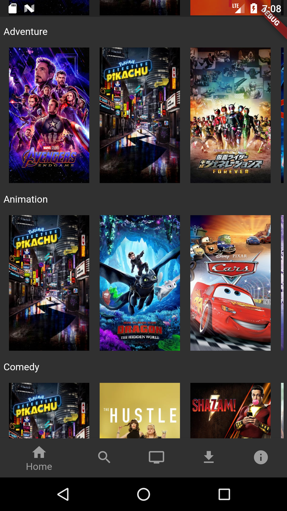
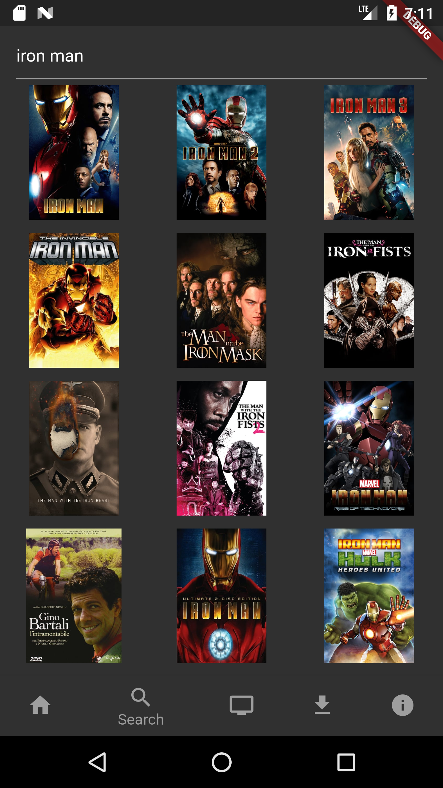

# BuddyFlix

This app was created in order to study Futter + Dart development. It means to be a Netflix clone app, but only to search movie titles.

 

## Running the app

Before running the app, you'll need to get a api key of MovieDB. Then create `secrets.json` in the root folder, just as shown below:

    {
        "moviedb_api_key": "YOUR API KEY HERE"
    }

It should be enough. Then just run the command:

    $ flutter run

It is also available on Play Store

